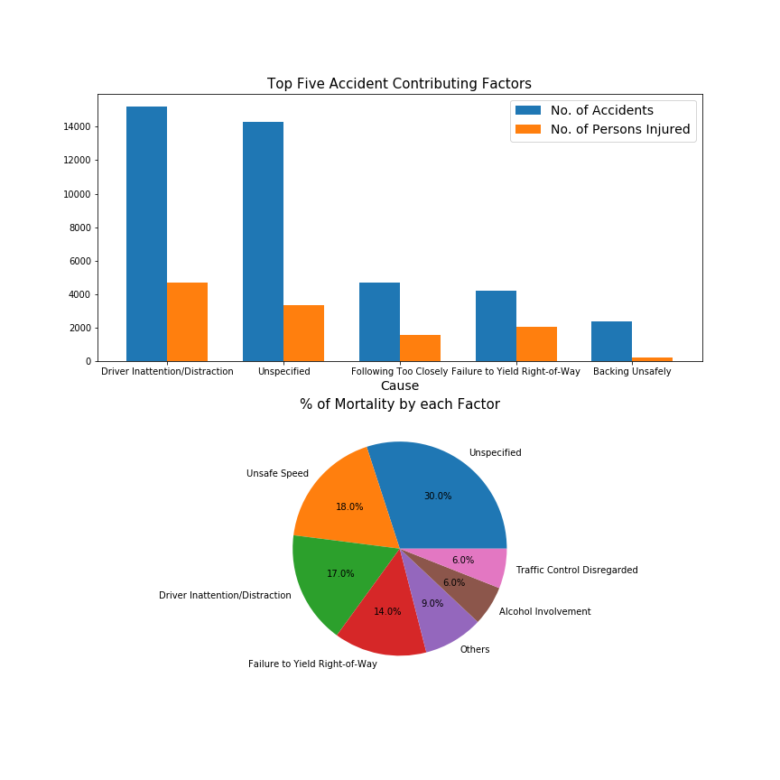
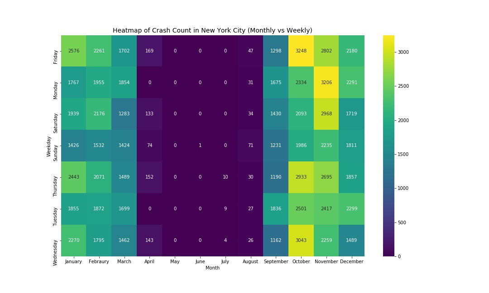
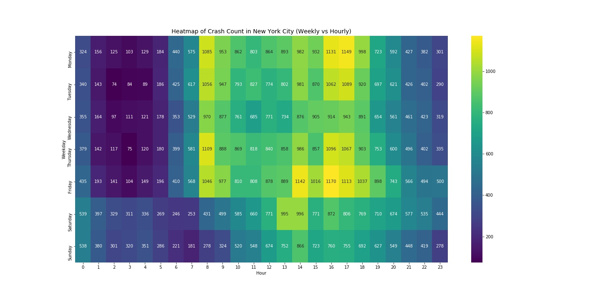

# Visualization of New York City Motor Vehicle Collisions Data 

Authors: **Arvind Ram Karthikeyan**, **Harish Kannan Venkataramanan**, **Aravindh Siddharth Prabaharan** and **Praveen Mohan**

---

## Introduction
*The data is pulled from NYC Open Data.*
*It consists of records for motor vehicle damage worth more than $1000 and casualties.*
*The key factors used in this data visualization are contributing factors for the crash, Number of persons injured, Number of persons     killed, crash date, crash time and crash location.*

---

## Sources
- The source code came from [NYC Open Data](https://opendata.cityofnewyork.us/)
- The code retrieves data from [API source](https://data.cityofnewyork.us/Public-Safety/Motor-Vehicle-Collisions-Crashes/h9gi-nx95)
- The link to create a account in [Socrata](https://dev.socrata.com/foundry/data.cityofnewyork.us/h9gi-nx95)
- The code to create a heatmap using [Seaborn Package](https://dev.socrata.com/foundry/data.cityofnewyork.us/h9gi-nx95)
- The link to use [Gmap](https://cloud.google.com/maps-platform/)
---

## Explanation of the Code

The code, `API_NYC_crashdata.py`, begins by importing necessary Python packages:
```
import matplotlib.pyplot as plt
import pandas as pd
from sodapy import Socrata
import seaborn as sns
import gmaps
from ipywidgets.embed import embed_minimal_html
```
- *Note:The following packages need to be installed:* 
- *pip install seaborn*
- *pip install sodapy*
- *pip install gmaps (If using Jupyter notebook $ jupyter nbextension enable --py --sys-prefix gmaps)*
- *pip install ipywidgets.embed*

We then import data from NYC Open Data using User Credentials and API Token by calling API:
```
username = input("Enter the Username") # Prompts the user credentials for the API
password = input("Enter the password") 
MyAppToken = input('Enter the app token')
client = Socrata('data.cityofnewyork.us', MyAppToken, username=username,password=password)
results = client.get("h9gi-nx95", limit=100000) # get() pulls the dynamic data from the API.
results_df = pd.DataFrame.from_records(results) 
```
- *NOTE 1: The data pulled using API is in json format and it is converted to a data frame named "results_df".*  
- *NOTE 2: The data may change over time and the results may not be same everytime.*
```
results_df['year'] = pd.DatetimeIndex(results_df['crash_date']).year # year, month, weekday and hour features are extracted from crash_date
- *pip install sodapy*
results_df['month'] = pd.DatetimeIndex(results_df['crash_date']).month
results_df['weekday'] = pd.DatetimeIndex(results_df['crash_date']).weekday
results_df['hour'] = pd.DatetimeIndex(results_df['crash_time']).hour
df1=results_df[(results_df.year >= 2019)] # The crash data on and after 2019 year is used for visualization
```


### Data Visualization:
#### Visualization of prominent Contributing Factors using Stacked Bar and Pie Chart
```
#---------------------Bar plot------------------------------------------------

newframe = pd.DataFrame(df1.groupby(['contributing_factor_vehicle_1'])['number_of_persons_killed'].count()) # Counts the number of Accidents
newframe1 = pd.DataFrame(df1.groupby(['contributing_factor_vehicle_1'])['number_of_persons_injured'].sum()) #Counts the number of persons injured
newframe2 = pd.merge(newframea, newframe1, on='Cause') # Merges the top contributing factors' accident counts and their respective number of injuries
newframe2 = newframe2.head(5) # Picks the top contributing factors
newframe2 = newframe2.rename(columns = {"number_of_persons_injured":"No. of Persons Injured", "number_of_persons_killed":"No. of Accidents"})
fig,(ax1,ax2) =plt.subplots(2,1,figsize = (12,12))   # Fixes the size and subplot place
ax = newframe2.plot.bar(rot=0,ax=ax1, width = 0.7)   # Plots the stacked bar plot 
ax.legend(fontsize = 14)
ax.xaxis.label.set_size(14)
ax.set_title('Top Five Accident Contributing Factors', fontsize = 15)
plt.xticks(fontsize = 9, wrap = True)

#---------------------Pie plot-------------------------------------------------
newframe3 = pd.DataFrame(df1.groupby(['contributing_factor_vehicle_1'])['number_of_persons_killed'].sum()) # Sums the number of persons killed
Others = sum(newframe3['number_of_persons_killed']==1) # Adds the killed values that is equal to 1 to "Other" contributing factor
newframe3=newframe3[newframe3['number_of_persons_killed']>1] # Picks the contributing factor where the killed is greater than 1
newframe3 = newframe3.append({'number_of_persons_killed':Others,'Cause':'Others'},ignore_index=True) # Adds the "Other" to the rows
newframe3 = newframe3.head(7) # Picks only top seven contributing factor
newframe3['number_of_persons_killed'] = round((newframe3['number_of_persons_killed']/a)*100,0) # Calculates the percetage of death by each contributing factor in total kills

ax2.pie(newframe3['number_of_persons_killed'],labels=newframe3['Cause'],autopct='%1.1f%%') # Plots the Pie chart
ax2.set_title('% of Mortality by each Factor', fontsize = 15)
plt.savefig('Bar_Pie.png')
```
Finally, we visualize the data.  We save our plot as a `.png` image:
```
plt.savefig('Bar_Pie.png')	
plt.show()
```

The output from this code is shown below:


#### Heatmap (Monthly vs Weekly)

```
heatmap_df1["Month"] = pd.Categorical(heatmap_df1["Month"], heatmap_df1.Month.unique()) 
plt.figure(figsize = (15, 9)) # Assigning figure size (length & breadth) for the plot
file_long = heatmap_df1.pivot("Weekday", "Month", "Crash_Count") # Assigning the column names for which the heatmap needs to be plotted
sns.heatmap(file_long, cmap = 'viridis', annot=True, fmt=".0f") # Plotting the map
plt.title("Heatmap of Crash Count in New York City (Monthly vs Weekly)", fontsize = 14); # Assigning title for the plot
plt.savefig('Heatmap1.jpg') # Saving the plot
```
The output from this code is shown below:


#### Heatmap (Weekly vs Hourly)
```
heatmap_df2["Weekday"] = pd.Categorical(heatmap_df2["Weekday"], heatmap_df2.Weekday.unique())
plt.figure(figsize = (20, 10))
file_long = heatmap_df2.pivot("Weekday", "Hour", "Crash_Count")
sns.heatmap(file_long, cmap = 'viridis', annot=True, fmt=".0f")
plt.title("Heatmap of Crash Count in New York City (Weekly vs Hourly)", fontsize = 14);
plt.savefig('Heatmap2.jpg')
```

The output from this code is shown below:


#### GMAPS Heatmap on NYC

```
#------------------------Visualizing using Gmaps-------------------------------

locations=pd.DataFrame(results_df[['latitude','longitude']])
locations[['latitude','longitude']] = locations[['latitude','longitude']].astype(float) #Latitude and Longitude data are stored as float

gmaps.configure(api_key='Key Here') #GMAPS API key is inserted
nyc_coordinates = (40.7128, -74.0060)
fig = gmaps.figure(center=nyc_coordinates, zoom_level=10.5) #Map co-ordinates along with zoom level is set
heatmap_layer=gmaps.heatmap_layer(locations) #heatmap layer is created using latitude,longitude
heatmap_layer.max_intensity = 200
heatmap_layer.point_radius = 15
fig.add_layer(heatmap_layer)
embed_minimal_html('Heatmap_layer.html', views=[fig]) #heatmap file is exported in save directory
```

The output from this code is shown below:


---

## How to Run the Code
### Using Terminal
*1. Open a terminal window.*

*2. Change directories to where `API_NYC_crashdata.py` is saved.*

*3. Type the following command:*
	```
	python API_NYC_crashdata.py
	```
    
### Using Spyder/ Jupyter
*1. Click on File->Open*

*2. Choose directory where `API_NYC_crashdata.py` is stored*

*3. Click on run or press F5 on Spyder, Shift+Enter in Jupyter*

---

## Suggestions
Weather data can be added to understand how the weather influences different contributing factors of the accidents. It can also be used to understand the severity of accidents with respect to different weather conditions.

GMAPS Visualization Modification:
Maps of different type can be set using a parameter```map_type=Hybrid/Satellite``` in ```gmaps.figure``` . Markers can be set to the map using the following code ```gmaps.marker_layer```
